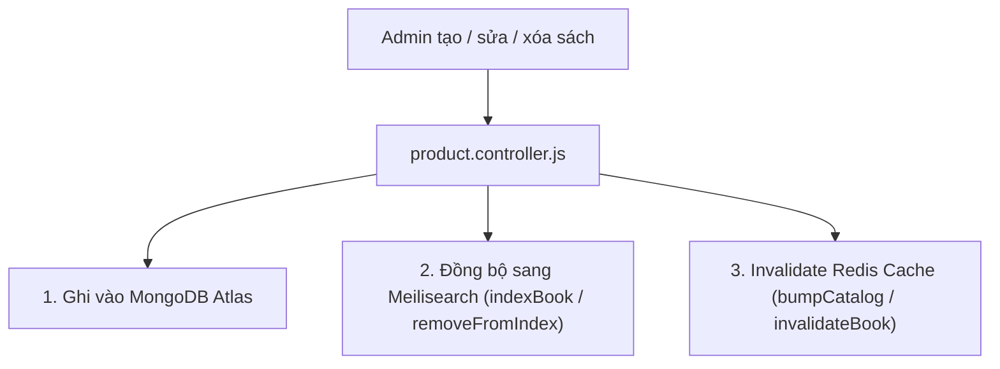

# 🔍 Meilisearch — Cơ Chế Hoạt Động & Tích Hợp Hệ Thống

Tài liệu này giải thích chi tiết kiến trúc, luồng dữ liệu, cơ chế đồng bộ và chiến lược dự phòng (fallback) của **Meilisearch** trong **Product Service**.

---

## 1. Luồng tìm kiếm sách (Search Flow)

Khi người dùng tìm kiếm trên giao diện (ví dụ gõ `"harry potter"` hoặc `"de men"`):

```mermaid
sequenceDiagram
    autonumber
    actor User as Khách hàng
    participant FE as Frontend (:5173)
    participant Gateway as Backend Monolith (:5001)
    participant PS as Product Service (:5002)
    participant Redis as Upstash Redis Cache
    participant Meili as Meilisearch (GCP VM :7700)
    participant Mongo as MongoDB Atlas (bookstore_products)

    User->>FE: Gõ từ khóa tìm kiếm "harry potter"
    FE->>Gateway: GET /api/v1/books?search=harry+potter
    Gateway->>PS: Proxy request sang Product Service
    
    PS->>Redis: Kiểm tra cache (key: books:v<ver>:search=harry+potter)
    alt Cache Hit (Có trong Redis)
        Redis-->>PS: Trả về kết quả JSON đã cache
        PS-->>Gateway: Trả về client ngay lập tức (< 10ms)
    else Cache Miss (Chưa có trong Redis)
        alt Meilisearch khả dụng (isMeiliEnabled = true)
            PS->>Meili: Search query: "harry potter"
            Meili-->>PS: Trả về danh sách IDs [ "id_1", "id_2", ... ]
            PS->>Mongo: Book.find({ _id: { $in: [ids] } }) (Lấy full data)
            Mongo-->>PS: Danh sách documents đầy đủ
        else Meilisearch Down / Lỗi kết nối
            PS->>Mongo: Fallback tìm kiếm bằng Regex ($regex i)
            Mongo-->>PS: Kết quả tìm kiếm từ MongoDB
        end
        PS->>Redis: Lưu kết quả vào Redis Cache (TTL)
        PS-->>Gateway: Trả về kết quả cho Frontend
    end
    Gateway-->>FE-->>User: Hiển thị danh sách sách trên UI
```

---

## 2. Meilisearch lưu trữ những dữ liệu gì?

> [!IMPORTANT]
> **MongoDB Atlas luôn là nguồn dữ liệu gốc (Single Source of Truth).**  
> Meilisearch **không phải là database chính**, mà chỉ đóng vai trò là **Search Index Layer**.

Mỗi document trong Meilisearch index `books` chỉ lưu các trường phục vụ tìm kiếm, lọc và sắp xếp:

```json
{
  "id": "6abfe20ece7e32e59cf19b68",
  "title": "Dế Mèn Phiêu Lưu Ký",
  "author": "Tô Hoài",
  "category": "Văn học",
  "price": 68000,
  "description": "Tác phẩm kinh điển của văn học thiếu nhi Việt Nam...",
  "isFlashSale": true,
  "flashSaleStartMs": 1791012357793,
  "flashSaleEndMs": 1791098700000,
  "createdAt": 1790960142966
}
```

- **`id`**: Chuỗi `String` của MongoDB ObjectId.
- **`flashSaleStartMs` / `flashSaleEndMs`**: Lưu dạng epoch timestamp số nguyên để Meilisearch lọc số nhanh bằng filter `flashSaleEndMs > 1700000000`.
- Các trường hình ảnh, đánh giá chi tiết, tồn kho động được query trực tiếp từ MongoDB sau khi Meilisearch trả về danh sách IDs khớp nhất.

---

## 3. Cơ chế đồng bộ dữ liệu (Data Synchronization)

Meilisearch và MongoDB được đồng bộ tự động 100% trong code, không cần cron job:



### Chi tiết các sự kiện đồng bộ:
1. **Khi Admin thêm sách (`POST /api/v1/books`):**
   - Lưu vào MongoDB ➔ Gọi `indexBook(book)` đẩy document mới lên Meilisearch ➔ Gọi `bumpCatalog()` xóa cache danh sách.
2. **Khi Admin cập nhật sách (`PATCH /api/v1/books/:id`):**
   - Cập nhật MongoDB ➔ Cập nhật document trên Meilisearch ➔ Xóa cache `book:<id>` và tăng `catalog:v`.
3. **Khi Admin xóa sách (`DELETE /api/v1/books/:id`):**
   - Xóa trong MongoDB ➔ Gọi `removeFromIndex(id)` trên Meilisearch ➔ Xóa cache.
4. **Khi Product Service khởi động lại:**
   - Trong `src/index.js`, service kiểm tra MongoDB và tự động re-index nếu cần:
     ```js
     const books = await Book.find();
     if (books.length) await indexBooks(books);
     ```

---

## 4. So sánh: Meilisearch vs. MongoDB Regex Search

| Tiêu chí | MongoDB `$regex` truyền thống | Meilisearch Engine |
| :--- | :--- | :--- |
| **Tìm kiếm gõ sai (Typo)** | ❌ Gõ `"harry ptter"` không ra kết quả | ✅ Tự động sửa lỗi chính tả (Typo tolerance) |
| **Tiếng Việt không dấu** | ❌ Phải làm thêm trường unaccent hoặc index nặng | ✅ Tự động nhận diện `"de men"` ➔ *"Dế Mèn"* |
| **Thứ tự từ khóa** | ❌ `"potter harry"` không khớp chuỗi gốc | ✅ Khớp theo từng token độc lập bất kể thứ tự |
| **Độ phức tạp tính toán** | Chậm (Full collection scan khi dữ liệu lớn) | Cực nhanh nhờ cấu trúc Inverted Index & LMDB |
| **Tốc độ phản hồi trung bình** | ~100ms – 500ms | **~5ms – 25ms** |

---

## 5. Cơ chế chịu lỗi tự động (Graceful Fallback)

Nếu máy chủ Meilisearch gặp sự cố (bảo trì, down VM, nghẽn mạng), hệ thống **hoàn toàn không bị gián đoạn**:

```js
// product-service/src/controllers/book.controller.js
const meili = await searchBooks({ search, category, minPrice, maxPrice, sort, offset, limit })
  .catch((err) => {
    console.error('⚠️ Meilisearch fallback sang MongoDB:', err.message);
    return null; // Trả về null khi có lỗi
  });

if (meili) {
  // Ưu tiên 1: Lấy danh sách ID chính xác từ Meilisearch
  const books = await Book.find({ _id: { $in: meili.ids } });
  return res.json({ status: 'success', data: { books } });
} else {
  // Ưu tiên 2 (Dự phòng): Tự động quay về truy vấn MongoDB Regex
  const filter = mongoFilter({ search, category, minPrice, maxPrice });
  const books = await Book.find(filter).sort(sort).skip(offset).limit(limit);
  return res.json({ status: 'success', data: { books } });
}
```

Khách hàng vẫn có thể tìm kiếm và mua sách bình thường, hệ thống chỉ chậm hơn một chút trong lúc Meilisearch phục hồi.

---

## 6. Kiến trúc triển khai Meilisearch trên GCP VM

```
                  Internet / Cloud Run Product Service
                                 │
                                 ▼
                     GCP Firewall: allow tcp:7700
                                 │
     ┌───────────────────────────┴───────────────────────────┐
     │ GCP VM (e2-micro Always Free, Debian 12)             │
     │                                                       │
     │ [Cách 1: Expose trực tiếp (Dev / Staging)]           │
     │   systemd service: meilisearch.service                │
     │   listen: 0.0.0.0:7700                                │
     │   bảo vệ bằng: MEILI_MASTER_KEY                      │
     │                                                       │
     │ [Cách 2: Nginx Reverse Proxy + SSL (Production)]      │
     │   Nginx Reverse Proxy: listen 443 (HTTPS)             │
     │   proxy_pass ➔ 127.0.0.1:7700                         │
     │   Let's Encrypt Certbot SSL                           │
     └───────────────────────────────────────────────────────┘
```

- **Môi trường Dev / Staging:** Meilisearch lắng nghe trực tiếp trên `0.0.0.0:7700`, bảo vệ bằng Master Key 64-ký tự ngẫu nhiên.
- **Môi trường Production:** Khuyến nghị đặt Meilisearch sau Nginx reverse proxy với HTTPS (`setup-nginx-meili.sh`) hoặc thiết lập Serverless VPC Access Connector trên GCP.